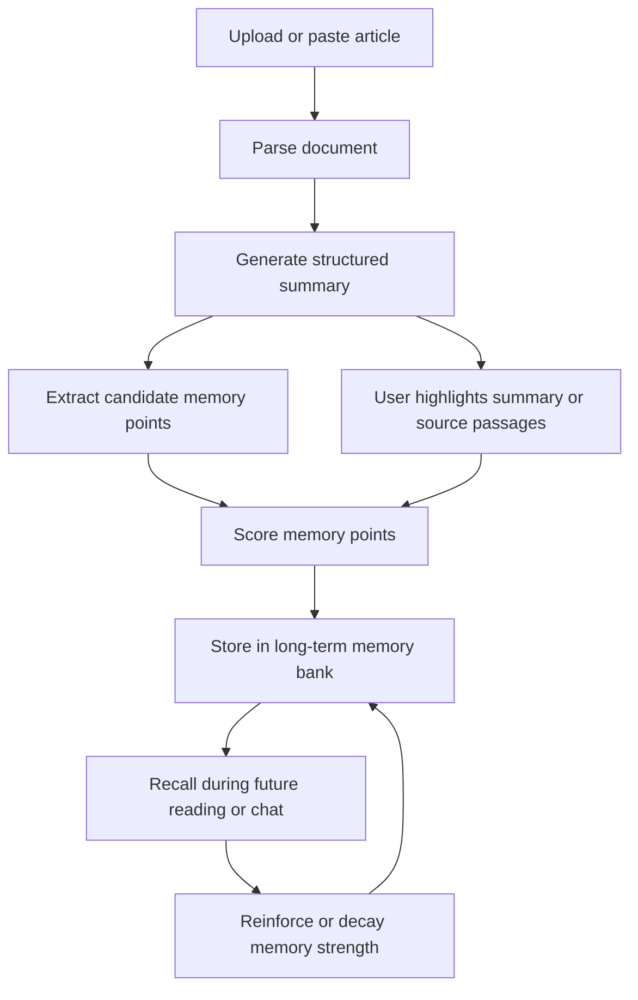

# MemoryRush

MemoryRush is the working repository for **MemoryPoint**, a human-inspired AI reading memory system that learns not only to retrieve documents, but to decide what is worth remembering, how strongly it should be remembered, and when it should be recalled.

The core idea is simple: after a user reads or uploads an article, the system summarizes the article, extracts candidate memory points, lets the user highlight important passages, and stores high-value memories in a dynamic memory bank. Memories can later be recalled in conversation, reinforced when reused, and gradually decayed when they stop being useful.

Full project concept: [docs/MemoryPoint_Project_Plan.md](docs/MemoryPoint_Project_Plan.md)

Current research specification: [docs/RESEARCH_SPEC.md](docs/RESEARCH_SPEC.md)

Current research plan: [docs/RESEARCH_PLAN.md](docs/RESEARCH_PLAN.md)

Implementation task list: [tasks/todo.md](tasks/todo.md)

Earlier MVP docs are kept for project history: [docs/PRODUCT.md](docs/PRODUCT.md), [docs/SPEC.md](docs/SPEC.md), [docs/ARCHITECTURE.md](docs/ARCHITECTURE.md), [docs/ROADMAP.md](docs/ROADMAP.md)

Research roadmap and timeline: [docs/MemoryPoint_Research_Roadmap.md](docs/MemoryPoint_Research_Roadmap.md)

中文版研究路线图与周期预估：[docs/MemoryPoint_Research_Roadmap_CN.md](docs/MemoryPoint_Research_Roadmap_CN.md)

中文实施清单：[docs/MemoryPoint_Implementation_Checklist_CN.md](docs/MemoryPoint_Implementation_Checklist_CN.md)

## Quickstart

Phase 0 sets up a local-first Python project skeleton. The first runnable checks are intentionally small:

Recommended Python version: `3.10`-`3.12`. Some ML dependencies may lag behind new Python releases.

```powershell
python -m venv .venv
.\.venv\Scripts\Activate.ps1
pip install -r requirements.txt
python scripts/check_setup.py
python -m memoryrush.cli samples
python scripts/parse_docs.py data/sample_docs
streamlit run app/streamlit_app.py
```

Optional local LLM setup for later phases:

```powershell
ollama pull qwen2.5:7b-instruct
```

## Research Framing

Most RAG systems behave like search engines: they retrieve relevant chunks only after the user asks a question. MemoryPoint adds a long-term memory layer on top of standard document retrieval.

Instead of saving every chunk equally, it tries to answer:

- Which ideas from this document are worth remembering?
- Which passages did the user explicitly care about?
- Which old memories does a new article support, challenge, or extend?
- Which memories should become stronger through repeated recall?
- Which unused memories should fade over time?

## Research Target

MemoryRush is designed to go beyond a prompt-based RAG demo. The complete version combines a local research prototype, an annotated dataset, ML ranking baselines, dynamic memory scoring, and rigorous evaluation.

Core research questions:

```text
RQ1: Can memory-point retrieval outperform standard chunk-based RAG for long-term reading recall?

RQ2: Can user highlights and recall history improve personalized memory ranking?

RQ3: Does reinforcement and decay improve retrieval quality over static memory storage?
```

Target deliverables:

- Public GitHub repository with reproducible setup.
- Working Streamlit demo with reading, highlighting, memory review, memory bank, and recall chat.
- 100-document annotated reading-memory dataset.
- TF-IDF, Sentence-BERT, MLP, LLM scorer, and hybrid MemoryRanker baselines.
- Evaluation against standard RAG, summary-only memory, static memory points, and ablated MemoryPoint variants.
- 6-8 page technical report with dataset, method, experiments, results, limitations, and future work.
- Screenshots and a short demo video.

## Core Workflow



## Key Features

- Article ingestion from PDF, DOCX, Markdown, TXT, pasted text, and web URLs.
- Reading view with original paragraphs, AI summary, candidate memory points, and paragraph-level highlights.
- Highlight labels such as `important`, `surprising`, `useful`, `disagree`, `remember_this`, and `unclear`.
- Memory point extraction with source evidence, tags, type classification, and base scoring.
- Dynamic memory strength based on importance, novelty, personal relevance, recall count, user feedback, reinforcement, and decay.
- Conversational recall grounded in document chunks, memory points, highlights, and cited sources.
- Evaluation plan comparing MemoryPoint against standard RAG, summary-only memory, and static memory points.

## Architecture

The project uses a local-first modular monolith. Streamlit and CLI are entry points; domain models, application use cases, AI pipeline stages, provider adapters, persistence, and evaluation should remain separate. See [docs/ARCHITECTURE.md](docs/ARCHITECTURE.md) for the full architecture.

```text
UI / CLI
  -> application use cases
    -> domain models and services
    -> AI pipeline stages
      -> provider interfaces
        -> local model adapters
    -> persistence repositories
      -> SQLite / JSONL / vector index
    -> evaluation services
```

## Suggested Stack

| Module | Tools |
|---|---|
| PDF parsing | PyMuPDF, pdfplumber |
| DOCX parsing | python-docx |
| Web parsing | BeautifulSoup, trafilatura |
| Chunking | LangChain, LlamaIndex, custom splitter |
| Embeddings | bge-small, e5-base, sentence-transformers |
| Vector database | Chroma, FAISS, Qdrant |
| Reranking | bge-reranker, cross-encoder |
| LLM | Qwen, Llama, OpenAI API, Ollama |
| Long-term storage | SQLite |
| Graph relations | NetworkX, optional Neo4j |
| UI | Streamlit |
| Evaluation | scikit-learn, pandas, numpy, optional RAGAS |

## Research Roadmap

### Phase 1: Repository and Ingestion Foundation

- Create the Python project structure, configuration, and sample data layout.
- Implement PDF, TXT, Markdown, and pasted-text ingestion.
- Preserve source metadata such as document ID, paragraph ID, page, section, and source path.

### Phase 2: Baseline RAG

- Implement chunking, embeddings, vector storage, retrieval, and source-grounded answers.
- Establish standard chunk-based RAG as the first evaluation baseline.

### Phase 3: Memory Point MVP

- Generate article summaries and candidate memory points.
- Bind each memory point to source evidence spans.
- Store memory points, tags, memory types, and base scores in SQLite.

### Phase 4: Reading Review UI

- Build a Streamlit reading page with original text, summary, highlights, and memory review.
- Add `Accept`, `Edit`, `Reject`, highlight labels, and user notes.
- Build a memory bank page with filtering, sorting, sources, and recall history.

### Phase 5: Annotated Dataset

- Collect roughly 100 long-form documents from AI, ML, cognition, HCI, and productivity topics.
- Annotate high-, medium-, and low-salience passages.
- Link each high-salience passage to a memory point, evidence span, topic tags, memory type, and highlight label.

### Phase 6: ML Ranking Baselines

- Train TF-IDF + Logistic Regression.
- Train Sentence-BERT + Logistic Regression.
- Train Sentence-BERT + MLP.
- Implement an LLM scorer baseline.
- Implement the final hybrid MemoryRanker.

### Phase 7: Dynamic Memory

- Track `recall_count`, `last_recalled_at`, `current_strength`, and recall events.
- Implement reinforcement and decay.
- Visualize memory strength changes over time.

### Phase 8: Recall Mode and Cross-Document Relations

- Retrieve related old memory points while reading new articles.
- Classify support, conflict, complement, and extension relations.
- Support chat over current documents and historical memory with cited sources.

### Phase 9: Evaluation and Ablations

- Compare standard RAG, summary-only memory, static memory points, MemoryPoint without highlight, MemoryPoint without decay, and full MemoryPoint.
- Report Precision@K, Recall@K, NDCG@K, MRR, citation correctness, unsupported answer rate, and user preference.

### Phase 10: Report and Portfolio Polish

- Write a 6-8 page technical report.
- Add screenshots, demo video, reproducible scripts, and final README results tables.
- Prepare a final project summary with measured improvements.

## Completion Estimate

Estimated effort depends heavily on whether the goal is a demo, a strong project version, or a complete evaluation version.

| Target | Scope | Estimated time |
|---|---|---:|
| Basic MVP | ingestion, RAG, memory extraction, simple UI | 2-3 weeks |
| Strong project version | MVP + memory bank + recall chat + dynamic scoring + clean README | 5-7 weeks |
| Evaluation version | dataset + ML baselines + ablations + report + demo video | 9-12 weeks |
| Complete version | polished product + reproducible experiments + report + quantified gains | 12-16 weeks |

Assuming focused solo work:

- 15-20 hours/week: about 3-4 months for the complete version.
- 25-30 hours/week: about 10-12 weeks.
- 40 hours/week: about 7-9 weeks, if the scope is controlled and annotation is kept small.

## Memory Scoring Direction

Initial memory score:

```text
base_score =
+ 0.18 * importance
+ 0.12 * novelty
+ 0.18 * personal_relevance
+ 0.14 * future_usefulness
+ 0.10 * surprise
+ 0.12 * cross_document_connectivity
+ 0.06 * evidence_strength
+ 0.10 * user_highlight_signal
```

Dynamic memory strength:

```text
memory_strength =
base_score * exp(-decay_rate * days_since_last_recall)
+ alpha * log(1 + recall_count)
+ beta * recent_recall_bonus
+ gamma * user_feedback_score
```

Final retrieval score:

```text
final_retrieval_score =
0.40 * semantic_similarity
+ 0.25 * memory_strength
+ 0.15 * personal_relevance
+ 0.10 * cross_document_connectivity
+ 0.05 * recency
+ 0.05 * source_quality
```

## Open Source Notes

This repository should contain only a clean public version of the project:

- Source code, README, architecture notes, sample documents, synthetic memory data, scoring logic, and evaluation results are okay to publish.
- Personal documents, real memory databases, reading logs, API keys, internship materials, private company data, paid course materials, and unauthorized PDFs should stay out of the repository.
